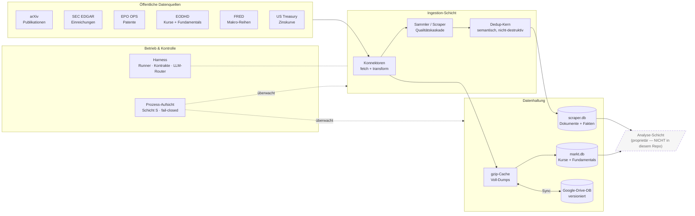

# Chronos-Stream — Dateninfrastruktur für makroökonomisches Research

**Chronos-Stream** ist eine quelloffene **Dateninfrastruktur**, die öffentlich verfügbare
wirtschaftliche Primärdaten (wissenschaftliche Publikationen, Patente, regulatorische
Einreichungen, Kurs- und Fundamentaldaten, makroökonomische Reihen) **kontinuierlich sammelt,
dedupliziert, punkt-in-der-Zeit-sauber (PIT) speichert und prozess-unabhängig überwacht**.

Sie ist die datentragende Basisschicht eines größeren Research-Systems. Die eigentliche
**Analyse- und Bewertungslogik ist bewusst NICHT Teil dieses Repositories** — Chronos-Stream liefert
ausschließlich sauber aufbereitete, reproduzierbare Daten an eine nachgelagerte Analyse-Schicht.

> **Sprache:** Der Code und die Dokumentation sind deutschsprachig (Docstrings, Bezeichner). Die
> Datenformate und externen Schnittstellen folgen den jeweiligen englischsprachigen Original-APIs.

---

## Was dieses System leistet

| Fähigkeit | Umsetzung |
|---|---|
| **Breite Datensammlung** | Konnektoren zu arXiv, SEC EDGAR, EPO (Patente), EODHD (Kurse/Fundamentals), FRED, US-Treasury |
| **Qualitäts- & Dedup-Pipeline** | Sammler mit Qualitätskaskade + semantischem Dedup (Embeddings, nicht-destruktiv) |
| **Point-in-Time-Speicherung** | Bitemporale Ablage (`t_event` / `t_disclosed` / `t_ingest`) — kein Look-Ahead |
| **Verlustfreie Aufzeichnung** | Jedes Dokument (auch abgelehnte) + jedes extrahierte Attribut mit gepinnter Extraktor-Version |
| **Cache- & Archiv-Schicht** | gzip-Cache lokal + versionierte Google-Drive-Datenbank (byte-genauer Round-Trip) |
| **LLM-Orchestrierung** | Provider-agnostischer Ensemble-Router (Ollama lokal, Gemini, Claude, OpenAI-kompatibel) mit Failover |
| **Prozess-unabhängiges Monitoring** | Externer Wächter (Schicht S): Liveness, Stagnation, Datenfrische, Kontrakt-Beobachtung, fail-closed |

Grundprinzip der Betriebsschicht: **„Stille ≠ Grün"** — Ausbleiben von Fehlern ist kein Beweis
für Funktion; der Wächter misst aktiv und schlägt fail-closed Alarm.

---

## Architektur im Überblick



Die gestrichelte **Analyse-Schicht** konsumiert die Daten dieses Repos, ist selbst aber nicht Teil
davon. Chronos-Stream endet exakt an der Grenze zwischen **Daten** und **Bewertung**.

Ausführliche Diagramme (Schichtenmodell, bitemporaler PIT-Datenfluss, Monitoring-Zustandsautomat)
in **[`docs/ARCHITEKTUR.md`](docs/ARCHITEKTUR.md)**.

---

## Komponenten

### `System/connectors/` — Datenquellen-Adapter
Jeder Konnektor trennt eine **verifizierbare Transformation** (Roh-Payload → strukturierter Eingang,
offline getestet) vom **Live-Abruf**. Enthalten u. a.:

| Konnektor | Quelle | Liefert |
|---|---|---|
| `arxiv_fetch` | arXiv | Publikationen (datiert, PIT) |
| `edgar_form_d`, `edgar_segment` | SEC EDGAR | Funding-/Segment-Einreichungen |
| `epo_ops` | EPO OPS 3.2 | Patent-Bibliografie + Zählreihen (OAuth2) |
| `eodhd_prices` | EODHD | EOD-Kurse, Fundamentals, survivorship-freies Universum |
| `fred_series` | FRED/ALFRED | makroökonomische Zeitreihen (Vintage-fähig) |
| `treasury_rates` | US Treasury | risikofreie Zinskurve rf(t) |
| `sammler_db`, `markt_db` | interne DBs | Dokument-/Markt-Speicherschemata (bitemporal) |
| `dedup_kern`, `hf_embedding` | — | eine kanonische semantische Dedup-Definition |
| `fundamentals_cache`, `eod_cache` | — | gzip-Voll-Dump-Caches (cache-first, redundanzfrei) |
| `gdrive`, `*_drive` | Google Drive | versionierte Datenbank-Auslagerung (REST, byte-genau) |

### `System/scraper.py` — Sammler (Ingestion-Kern)
Multi-threaded Sammler mit Qualitätskaskade, robusten Feed-Parsern, semantischem Dedup und
verlustfreier Aufzeichnung. Der Ingestion-Kern des Systems.

### `System/harness/` — Orchestrierung
Deterministischer Runner (Toposort, fail-closed) + maschinelle **Kontrakt-Validierung** +
append-only **Store** (Mem/SQLite) + **provider-agnostische LLM-Adapter** und ein **Ensemble-Router**
mit Fähigkeits-Leiter-Failover (Ollama lokal, Gemini, Claude, beliebige OpenAI-kompatible Endpunkte).

### `System/aufzeichnung.py` — verlustfreie Aufzeichnungsschicht
Schreibt jedes gesammelte Dokument (inkl. abgelehnter) und jedes extrahierte Attribut in eine
separate, PIT-saubere Datenbank — die reproduzierbare Grundlage jeder späteren Auswertung.

### `System/betrieb_aufsicht*.py` — Prozess-unabhängiges Monitoring (Schicht S)
Ein **separater** Wächter-Prozess, der von außen Heartbeats, Datenfrische und Roh-HTTP-Status liest
und in eine physisch getrennte Ops-Datenbank schreibt (überlebt den Ausfall der überwachten
Speicher). Liveness, Stagnation, Quota, Canary-Proben, Kontrakt-Beobachtung — alles fail-closed.

### `System/integration/` — Datenpflege & Taxonomie
Asynchrone Datenpflege, Fundamentals-Backfill, Aufbau der strukturierten Markt-DB, EOD-Scheduler
(`watchdog_batch.sh`) und die Branchen-/Klassifikations-Taxonomie (IPC/CPC/SIC → GIC-Kategorien).

---

## Datenquellen (alle öffentlich / frei zugänglich)

| Quelle | Inhalt | Zugang |
|---|---|---|
| arXiv | Preprints (Naturwissenschaft/Technik) | öffentlich, keyless |
| SEC EDGAR | US-Unternehmenseinreichungen | öffentlich, keyless |
| EPO OPS | europäische Patente | OAuth2 (kostenlose Registrierung) |
| EODHD | Kurse + Fundamentals (survivorship-frei) | API-Key |
| FRED / ALFRED | US-Makro-Zeitreihen | API-Key (kostenlos) |
| US Treasury | Par-Yield-Zinskurve | öffentlich, keyless |

API-Keys werden ausschließlich über Umgebungsvariablen bezogen und **nie** versioniert
(siehe `.gitignore`).

---

## Erste Schritte

```bash
git clone <REPO-URL> zeitfest
cd zeitfest

# Test-Suite (Standardbibliothek genügt; externe Pakete nur für optionale Live-Pfade)
for t in $(find System -name 'test_*.py' | sort); do python3 "$t"; done
```

Die Kern-Transformationen und die Aufzeichnungs-/Kontrakt-/Monitoring-Logik sind **rein und
offline testbar** (keine Netzabhängigkeit). Live-Abrufe (`fetch_*`) benötigen die jeweiligen
API-Keys als Umgebungsvariablen.

**Umfang der Test-Suite:** 26 Test-Dateien, vollständig grün, ~20 000 Zeilen Python über 75 Module.

---

## Projektumfang — was hier ist und was nicht

**In diesem Repository (offen):** Datensammlung, Deduplizierung, PIT-Speicherung, Caching/Archiv,
LLM-Orchestrierung, Betriebs-Monitoring, Taxonomie.

**Nicht in diesem Repository (proprietär):** die nachgelagerte Analyse- und Bewertungslogik, die
diese Daten interpretiert. Sie konsumiert die hier erzeugten Datenströme über klar definierte
Schnittstellen, ist aber bewusst getrennt gehalten.

---

## Lizenz

[MIT](LICENSE) — freie Weiterverwendung inkl. kommerziell, unter Beibehaltung des Lizenzhinweises.
