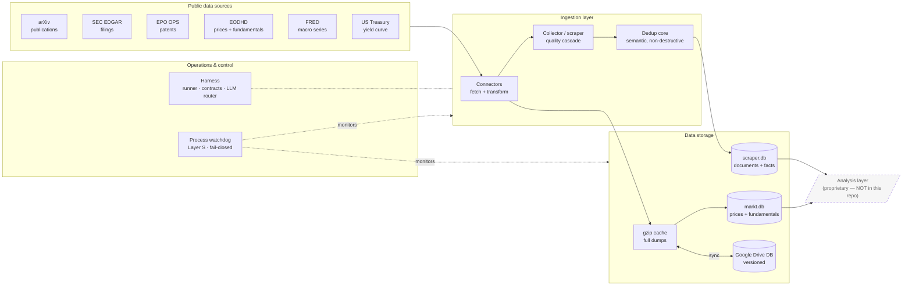

# Chronos-Stream — Data Infrastructure for Macroeconomic Research

**Chronos-Stream** is an open-source **data infrastructure** that continuously **collects,
deduplicates, stores point-in-time (PIT), and independently monitors** publicly available economic
primary data — scientific publications, patents, regulatory filings, price and fundamental data, and
macroeconomic series.

It is the data-bearing foundation layer of a larger research system. The actual **analysis and
valuation logic is deliberately NOT part of this repository** — Chronos-Stream delivers only clean,
reproducible data to a downstream analysis layer.

> **Language note:** The code and its documentation are written in German (docstrings, identifiers).
> Data formats and external interfaces follow the respective English-language origin APIs.

---

## What this system does

| Capability | Implementation |
|---|---|
| **Broad data collection** | Connectors to arXiv, SEC EDGAR, EPO (patents), EODHD (prices/fundamentals), FRED, US Treasury |
| **Quality & dedup pipeline** | Collector with a quality cascade + semantic deduplication (embeddings, non-destructive) |
| **Point-in-time storage** | Bitemporal storage (`t_event` / `t_disclosed` / `t_ingest`) — no look-ahead |
| **Lossless recording** | Every document (including rejected ones) + every extracted attribute, with a pinned extractor version |
| **Cache & archive layer** | Local gzip cache + a versioned Google Drive database (byte-exact round-trip) |
| **LLM orchestration** | Provider-agnostic ensemble router (local Ollama, Gemini, Claude, OpenAI-compatible) with failover |
| **Process-independent monitoring** | External watchdog (Layer S): liveness, stagnation, data freshness, contract observation, fail-closed |

Core principle of the operations layer: **"silence ≠ green"** — the absence of errors is not proof of
correct operation; the watchdog measures actively and raises fail-closed alerts.

---

## Architecture overview



The dashed **analysis layer** consumes this repository's data but is not part of it. Chronos-Stream
ends exactly at the boundary between **data** and **valuation**.

Detailed diagrams (layered model, bitemporal PIT data flow, monitoring state machine) are in
**[`docs/ARCHITEKTUR.md`](docs/ARCHITEKTUR.md)**.

---

## Components

### `System/connectors/` — data-source adapters
Each connector separates a **verifiable transformation** (raw payload → structured input, tested
offline) from the **live fetch**. Included among others:

| Connector | Source | Provides |
|---|---|---|
| `arxiv_fetch` | arXiv | publications (dated, PIT) |
| `edgar_form_d`, `edgar_segment` | SEC EDGAR | funding / segment filings |
| `epo_ops` | EPO OPS 3.2 | patent bibliography + count series (OAuth2) |
| `eodhd_prices` | EODHD | EOD prices, fundamentals, survivorship-free universe |
| `fred_series` | FRED/ALFRED | macroeconomic time series (vintage-aware) |
| `treasury_rates` | US Treasury | risk-free yield curve rf(t) |
| `sammler_db`, `markt_db` | internal DBs | document/market storage schemas (bitemporal) |
| `dedup_kern`, `hf_embedding` | — | a single canonical semantic dedup definition |
| `fundamentals_cache`, `eod_cache` | — | gzip full-dump caches (cache-first, redundancy-free) |
| `gdrive`, `*_drive` | Google Drive | versioned database offloading (REST, byte-exact) |

### `System/scraper.py` — collector (ingestion core)
Multi-threaded collector with a quality cascade, robust feed parsers, semantic dedup, and lossless
recording. The ingestion core of the system.

### `System/harness/` — orchestration
Deterministic runner (topological sort, fail-closed) + machine **contract validation** + append-only
**store** (in-memory/SQLite) + **provider-agnostic LLM adapters** and an **ensemble router** with
capability-ladder failover (local Ollama, Gemini, Claude, any OpenAI-compatible endpoint).

### `System/aufzeichnung.py` — lossless recording layer
Writes every collected document (including rejected ones) and every extracted attribute into a
separate, PIT-clean database — the reproducible basis for any later evaluation.

### `System/betrieb_aufsicht*.py` — process-independent monitoring (Layer S)
A **separate** watchdog process that reads heartbeats, data freshness, and raw HTTP status from the
outside and writes into a physically separate ops database (surviving the failure of the monitored
stores). Liveness, stagnation, quota, canary probes, contract observation — all fail-closed.

### `System/integration/` — data maintenance & taxonomy
Asynchronous data maintenance, fundamentals backfill, structured market-DB construction, EOD
scheduler (`watchdog_batch.sh`), and the industry/classification taxonomy (IPC/CPC/SIC → GIC
categories).

---

## Data sources (all public / freely accessible)

| Source | Content | Access |
|---|---|---|
| arXiv | preprints (science/engineering) | public, keyless |
| SEC EDGAR | US corporate filings | public, keyless |
| EPO OPS | European patents | OAuth2 (free registration) |
| EODHD | prices + fundamentals (survivorship-free) | API key |
| FRED / ALFRED | US macro time series | API key (free) |
| US Treasury | par-yield curve | public, keyless |

API keys are obtained exclusively via environment variables and are **never** committed (see
`.gitignore`).

---

## Getting started

```bash
git clone <REPO-URL> chronos-stream
cd chronos-stream

# Test suite (standard library is enough; third-party packages only for optional live paths)
for t in $(find System -name 'test_*.py' | sort); do python3 "$t"; done
```

The core transformations and the recording/contract/monitoring logic are **pure and testable
offline** (no network dependency). Live fetches (`fetch_*`) require the respective API keys as
environment variables.

**Test-suite scope:** 26 test files, all green, ~20,000 lines of Python across 75 modules.

---

## Project scope — what is and isn't here

**In this repository (open):** data collection, deduplication, PIT storage, caching/archiving, LLM
orchestration, operations monitoring, taxonomy.

**Not in this repository (proprietary):** the downstream analysis and valuation logic that interprets
this data. It consumes the data streams produced here through clearly defined interfaces but is kept
deliberately separate.

---

## License

[MIT](LICENSE) — free reuse including commercial, provided the license notice is retained.
