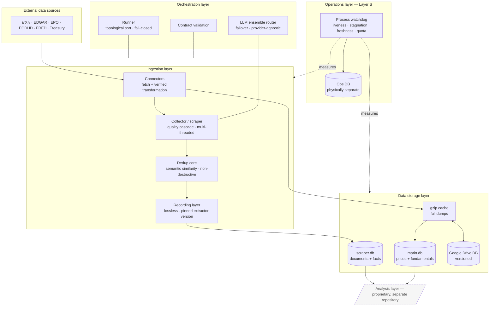
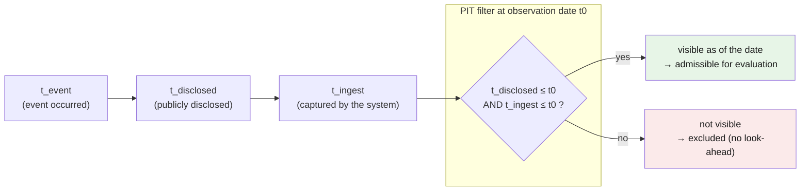
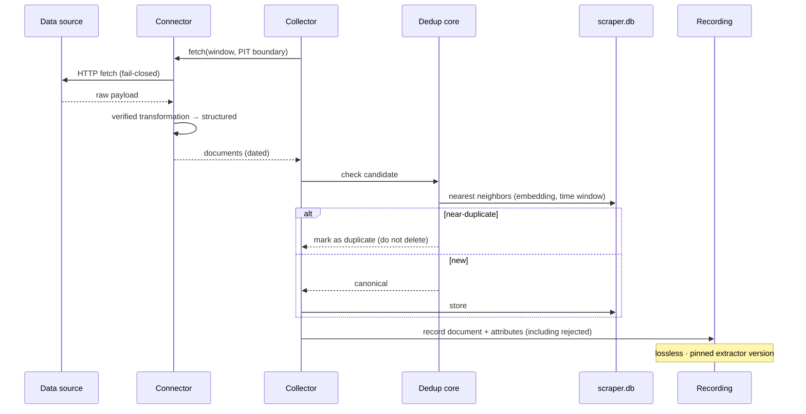
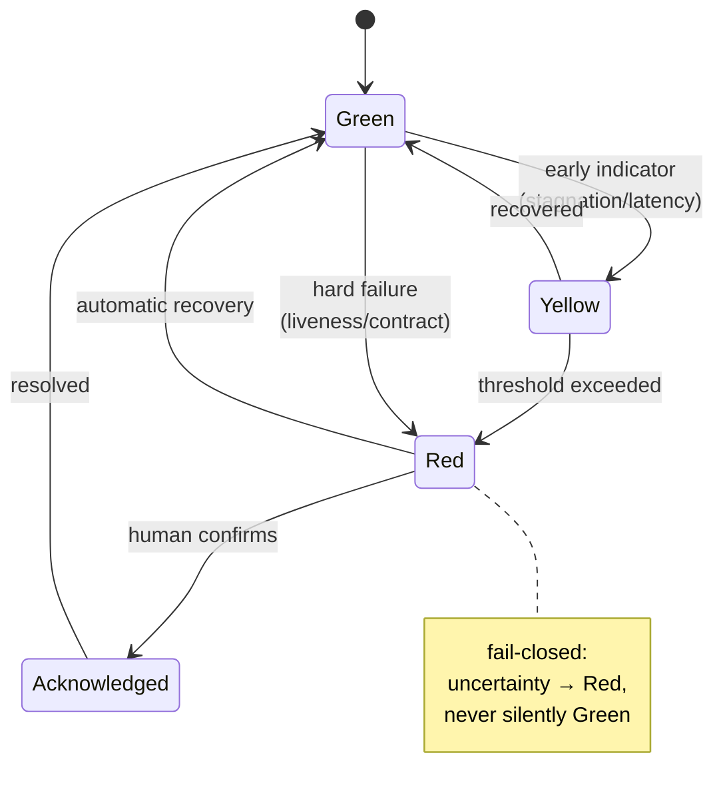
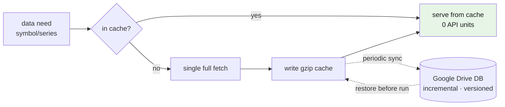

# Architecture — Chronos-Stream Data Infrastructure

This document describes the architecture of the open data infrastructure in diagrams. All diagrams
are written in [Mermaid](https://mermaid.js.org/) and render directly on GitHub.

The design follows four core principles:

1. **Separation of acquisition and computation** — the compute/analysis path never fetches live; it
   works exclusively on pre-stored data (cache-first). Live fetching is solely the job of the
   asynchronous data-maintenance layer.
2. **Point-in-time (PIT) / bitemporal** — every row separately carries "when it happened", "when it
   was disclosed", and "when we knew it". Retrospective evaluations can therefore never use future
   knowledge (no look-ahead).
3. **Lossless & redundancy-free** — every document is stored exactly once (dedup), nothing is deleted
   destructively, and data fetched once is not fetched again (cache).
4. **"Silence ≠ green"** — operations are actively measured by an independent process; the absence of
   errors does not count as proof of correct operation.

---

## 1. Layered model



Layers L0–L4 make up this repository. The **analysis layer** (dashed) is the consumer of the data and
is deliberately not included.

---

## 2. Bitemporal point-in-time data flow

Every datum carries three time axes. Only what was *knowable* as of the observation date may enter a
retrospective evaluation — the filter is fail-closed.



Example disclosure latency by source type (`t_disclosed − t_event`, in days), as anchored in the
recording layer:

| Source type | Latency | Reason |
|---|---|---|
| Publication | 2 | immediately public, only crawl latency |
| Patent | 3 | publication = filing + ~18 months; indexing |
| Funding filing | 2 | disclosure date = filing date; index latency |
| Macro series | 0 | the vintage timestamp IS the availability |

---

## 3. Ingestion sequence



Deduplication is **semantic** (embedding similarity rather than byte equality),
**non-destructive** (marking via `dup_of`, never deletion), and **source-type-aware** (a patent is
never marked as a duplicate of the paper it builds on).

---

## 4. Operations monitoring — state machine ("silence ≠ green")

An independent watchdog process evaluates operations from the outside. Alerts pass through a
debounced state machine with human acknowledgement.



The watchdog runs as a **separate process** and writes into a **physically separate ops database** —
so the diagnosis stays readable even if a monitored store fails. A dead-man's switch monitors the
watchdog itself.

---

## 5. Cache-first acquisition & versioned archiving

Data fetched once is cached locally and periodically offloaded to a versioned, authoritative Google
Drive database (byte-exact, verified round-trip).



The sync is **incremental** (only changed buckets), **loss-safe** (read-back verification before old
versions are cleaned up), and **redundancy-free** (one canonical state per bucket).

---

## Directory structure

```
System/
├── connectors/     data-source adapters (fetch + transformation) + cache/Drive sync
├── harness/        runner, contract validation, store, LLM ensemble router
├── integration/    data maintenance, backfill, market-DB construction, taxonomy, EOD scheduler
├── tests/          operations / recording / collector tests
├── scraper.py      collector (ingestion core)
├── aufzeichnung.py lossless recording layer
└── betrieb_*.py    process-independent monitoring (Layer S)
```
