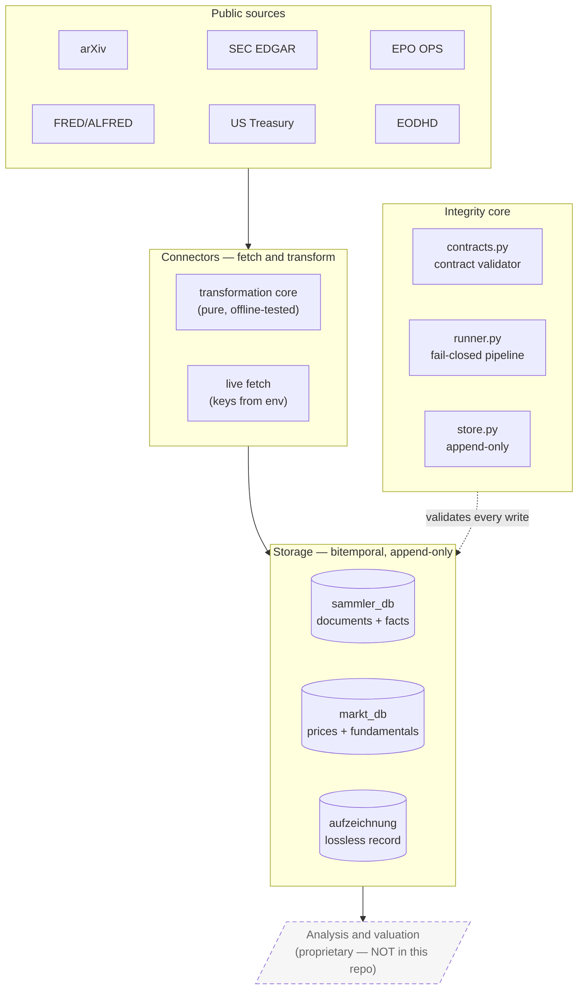
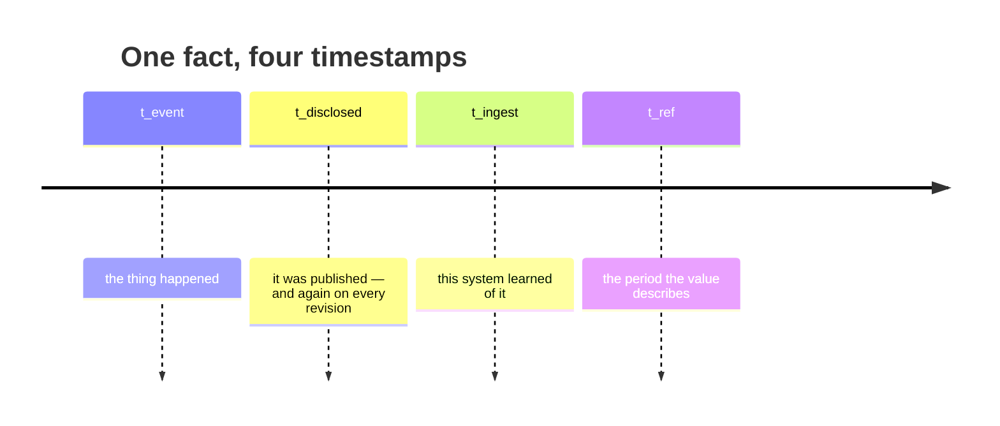
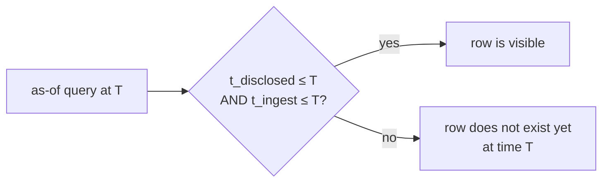
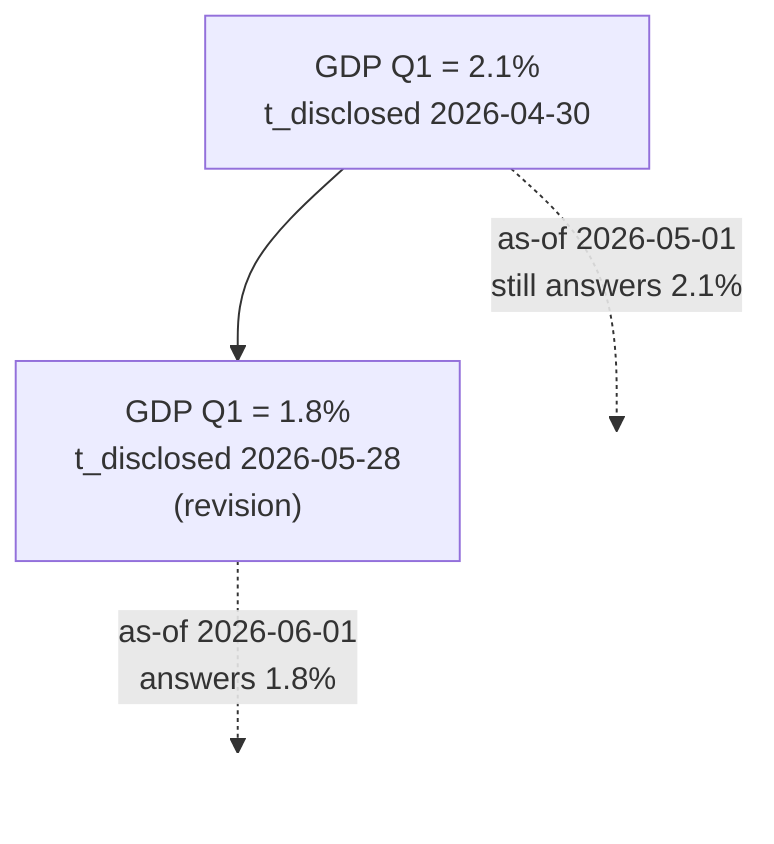
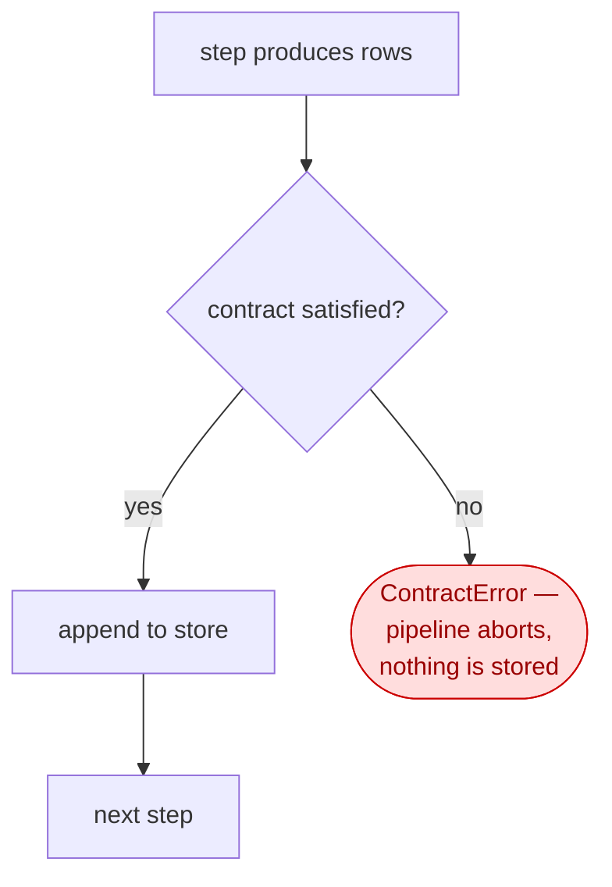
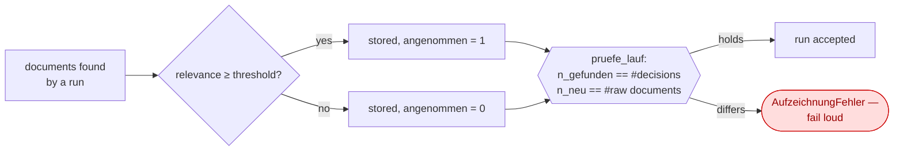

# Architecture — Chronos-Stream

How the point-in-time guarantee is actually enforced, in diagrams. All diagrams are Mermaid and
render directly on GitHub.

---

## 1. Layered model

Four layers, one direction. Nothing below reaches upward, and the analysis layer that consumes
this data is outside the repository entirely.



The split inside every connector is deliberate: the **transformation** from raw payload to
structured rows is a pure function and is tested offline against recorded payloads; the **live
fetch** is a thin shell around it. Correctness is therefore checkable without network or keys.

---

## 2. The four temporal roles

The heart of the design. A record is not one point in time but four, and every collapse of two
of them is a way for future knowledge to leak backwards.



An as-of query at time `T` admits a row only if `t_disclosed <= T` **and** `t_ingest <= T`. The
second condition is the one usually forgotten: a value may have been public before this system
could have known it, and using it anyway is look-ahead through the back door.



### Restatement is an append, never an edit



If the revision overwrote its predecessor, the first answer would be unreachable — and a
backtest run today would quietly use a number nobody had in May.

---

## 3. Fail-closed validation

Every step's output is validated against its table contract **before** it is stored. A violation
aborts the pipeline; it does not log a warning and continue.



The order matters and is tested: validation precedes the append, so an aborted run leaves no
partial rows for a later consumer to find. What the validator enforces:

| Rule | Why it exists |
|---|---|
| The temporal roles required by the table type are present and non-empty | Without them a cutoff cannot be evaluated at all |
| A contract that omits a required role is itself rejected | Otherwise every row passes while nothing is checked |
| Judged fields stay ordinal, measured fields stay numeric | A judgement dressed as a decimal invites arithmetic that means nothing |
| A category id never appears without its version | An unversioned id silently pins to "latest" — look-ahead in disguise |
| Non-nullable fields must be present and non-empty | Otherwise "contract-valid" is not a completeness statement |
| An unknown table type stops validation | Fail-closed: unrecognised must not mean unconstrained |

---

## 4. Lossless recording and its conservation law

Rejected documents are recorded too. The set of everything seen is the denominator of any later
statement about what was filtered out; keeping only the accepted ones destroys it irrecoverably.



The two sides of the comparison come from **different sources** — what the run reported versus
what was actually written. An identity computed from a single source could never break, and
would be decoration rather than a check.

---

## Directory structure

```
System/
  harness/
    contracts.py            contract validator — the invariants, machine-enforced
    runner.py               fail-closed pipeline with dependency ordering
    store.py                append-only store (in-memory and SQLite)
    tests/                  test_contracts · test_runner · test_store
  aufzeichnung.py           lossless recording + the conservation law
  connectors/
    arxiv_fetch.py          preprints
    edgar_form_d.py         SEC Form D — funding rounds
    edgar_segment.py        SEC segment reporting
    epo_ops.py              European patents (OAuth2)
    fred_series.py          macro series, vintage-aware
    treasury_rates.py       risk-free yield curve
    eodhd_prices.py         prices and fundamentals
    sammler_db.py           document/fact schema, bitemporal
    markt_db.py             market data schema, bitemporal
    eod_cache.py            fetch-once caches
    fundamentals_cache.py
    dedup_kern.py           one canonical semantic dedup definition
    hf_embedding.py         embeddings for that definition
    tests/
  integration/
    epo_abstract_backfill.py
    tests/
  tests/                    test_aufzeichnung
docs/
  ARCHITECTURE.md           this file
```

Run the whole suite offline, without keys:

```bash
for t in $(find System -name 'test_*.py' | sort); do
  (cd "$(dirname "$t")" && python3 "$(basename "$t")") || echo "FAILED: $t"
done
```
