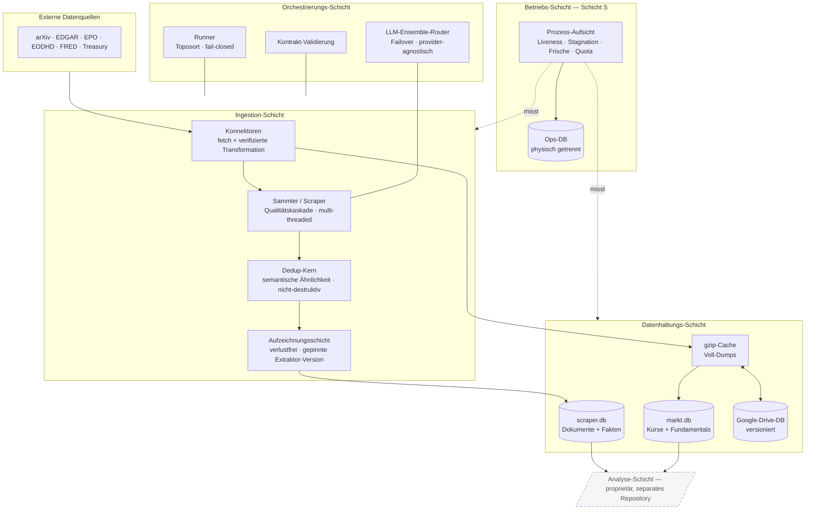
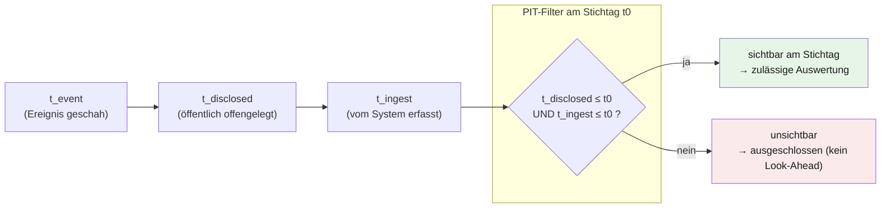
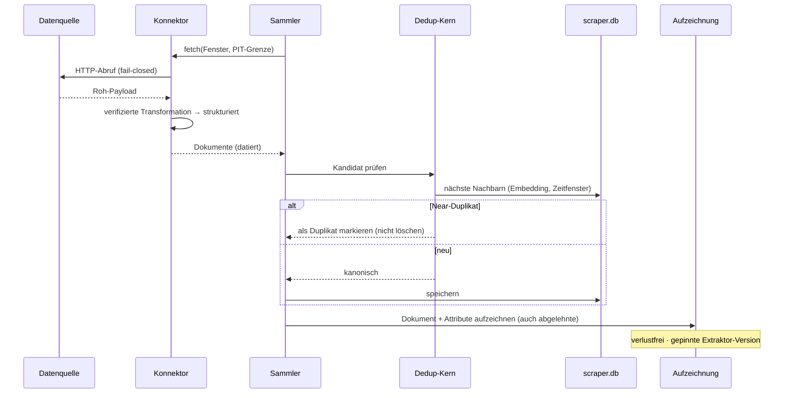
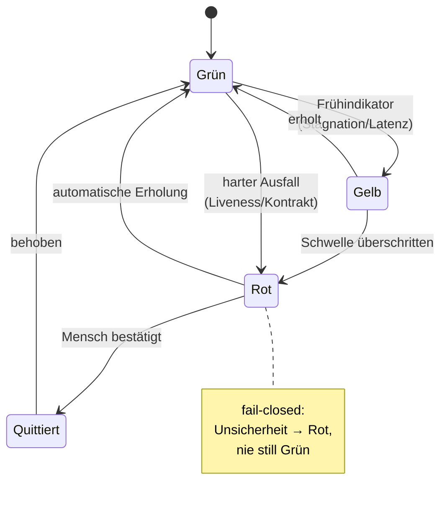
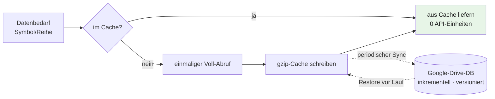

# Architektur — Chronos-Stream Dateninfrastruktur

Dieses Dokument beschreibt die Architektur der offenen Dateninfrastruktur in Diagrammen. Alle
Diagramme sind in [Mermaid](https://mermaid.js.org/) geschrieben und rendern direkt auf GitHub.

Der Aufbau folgt vier Grundprinzipien:

1. **Trennung von Beschaffung und Rechnen** — der Rechen-/Analysepfad ruft niemals live ab; er
   arbeitet ausschließlich auf vorgespeicherten Daten (cache-first). Live-Abruf ist allein Sache der
   asynchronen Datenpflege-Schicht.
2. **Point-in-Time (PIT) / bitemporal** — jede Zeile trägt getrennt „wann geschah es", „wann wurde es
   offengelegt" und „wann wussten wir es". Rückblickende Auswertungen können so kein Zukunftswissen
   verwenden (kein Look-Ahead).
3. **Verlustfreiheit & Redundanzfreiheit** — jedes Dokument wird genau einmal gespeichert (Dedup),
   nichts wird destruktiv gelöscht, und einmal abgerufene Daten werden nicht erneut geholt (Cache).
4. **„Stille ≠ Grün"** — der Betrieb wird von einem unabhängigen Prozess aktiv gemessen; Ausbleiben
   von Fehlern gilt nicht als Beweis für Funktion.

---

## 1. Schichtenmodell



Die Schichten L0–L4 bilden dieses Repository. Die **Analyse-Schicht** (gestrichelt) ist der
Konsument der Daten und bewusst nicht enthalten.

---

## 2. Bitemporaler Point-in-Time-Datenfluss

Jedes Datum trägt drei Zeitachsen. Nur was zum Stichtag *wissbar* war, darf in eine rückblickende
Auswertung einfließen — der Filter ist fail-closed.



Beispiel Publikations-Latenz je Quelltyp (`t_disclosed − t_event`, in Tagen), wie in der
Aufzeichnungsschicht verankert:

| Quelltyp | Latenz | Grund |
|---|---|---|
| Publikation | 2 | sofort öffentlich, nur Crawl-Latenz |
| Patent | 3 | Publikation = Anmeldung + ~18 Monate; Indexierung |
| Funding-Einreichung | 2 | Offenlegungsdatum = filingDate; Index-Latenz |
| Makro-Reihe | 0 | Vintage-Zeitstempel IST die Verfügbarkeit |

---

## 3. Ingestion-Sequenz



Die Deduplizierung ist **semantisch** (Embedding-Ähnlichkeit statt Byte-Gleichheit),
**nicht-destruktiv** (Markierung via `dup_of`, nie Löschung) und **quellentyp-bewusst** (ein Patent
wird nie als Duplikat des Papers markiert, auf dem es beruht).

---

## 4. Betriebs-Monitoring — Zustandsautomat („Stille ≠ Grün")

Ein unabhängiger Wächter-Prozess bewertet den Betrieb von außen. Alarme durchlaufen einen
entprellten Zustandsautomaten mit menschlicher Quittierung.



Der Wächter läuft als **separater Prozess** und schreibt in eine **physisch getrennte Ops-Datenbank**
— so bleibt die Diagnose auch dann lesbar, wenn ein überwachter Speicher ausfällt. Ein Dead-Man's-
Switch überwacht den Wächter selbst.

---

## 5. Cache-first-Beschaffung & versionierte Archivierung

Einmal abgerufene Daten werden lokal gecacht und periodisch in eine versionierte, führende
Google-Drive-Datenbank ausgelagert (byte-genauer, verifizierter Round-Trip).



Der Sync ist **inkrementell** (nur geänderte Buckets), **verlustsicher** (Read-back-Verifikation vor
dem Aufräumen alter Versionen) und **redundanzfrei** (ein kanonischer Stand je Bucket).

---

## Verzeichnisstruktur

```
System/
├── connectors/     Datenquellen-Adapter (fetch + Transformation) + Cache/Drive-Sync
├── harness/        Runner, Kontrakt-Validierung, Store, LLM-Ensemble-Router
├── integration/    Datenpflege, Backfill, Markt-DB-Aufbau, Taxonomie, EOD-Scheduler
├── tests/          Betriebs-/Aufzeichnungs-/Sammler-Tests
├── scraper.py      Sammler (Ingestion-Kern)
├── aufzeichnung.py verlustfreie Aufzeichnungsschicht
└── betrieb_*.py    prozess-unabhängiges Monitoring (Schicht S)
```
